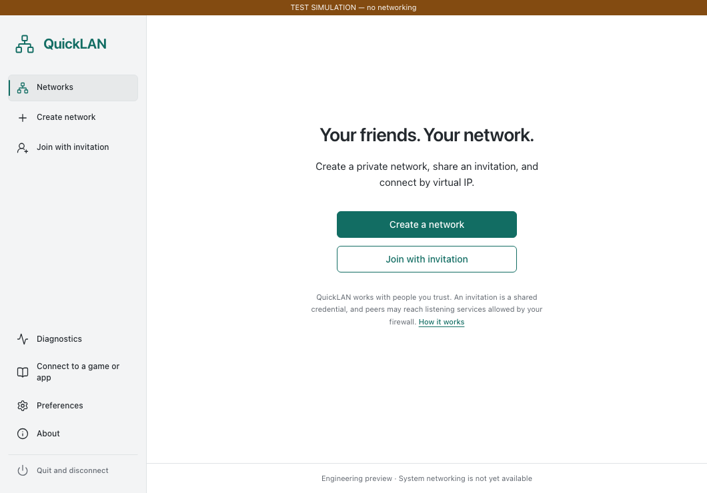

# QuickLAN

A desktop utility for private networks with friends, built with Tauri, Rust and React, integrating the separately licensed EasyTier core. No account or hosted control plane is required by the design. QuickLAN is independent of the EasyTier project.

**Engineering preview, not a working system VPN or public beta.** Saved networks, OS-protected credentials, invitation preview/import/copy, replacement credentials, preferences and sanitized diagnostics work. The desktop refuses to connect until authenticated helper installation and core policy enforcement are implemented and tested. It never substitutes simulated connections.

Real EasyTier 2.6.4 processes passed bidirectional TCP/UDP tests through real Linux TUN interfaces in two isolated kernel network stacks, including abrupt stop, restart and cleanup. Native CI built Windows x64 and both Mac architectures; Windows installation, launch, credential storage and uninstall passed. These are feasibility and preview checks, **not** proof of QuickLAN desktop VPN connectivity or cross-device NAT traversal. See [test evidence](docs/TEST_MATRIX.md) and [upstream findings](docs/UPSTREAM_CAPABILITIES.md).



Source: [BenjaminD2023/QuickLAN](https://github.com/BenjaminD2023/QuickLAN). Installer assets are staged in a **draft engineering release**, accessible to repository maintainers through [Releases](https://github.com/BenjaminD2023/QuickLAN/releases). See the [feature checklist](docs/FEATURES.md) for implemented and missing functionality.

## Develop

Verified locally: macOS 26.4.1 ARM64, Xcode, Rust 1.96.0, Node 22.22.3, npm 10.9.8, Python 3.9. Install the native [Tauri prerequisites](https://v2.tauri.app/start/prerequisites/) for your platform. Candidate targets are Windows 11 x64 and macOS 13+ on Apple Silicon and Intel; native CI also exercised macOS 15 ARM64/Intel builds and a Windows Server 2022 x64 runner. Windows 11 and minimum-version end-user compatibility remain unverified.

```sh
npm ci
npm run desktop:dev
```

`npm run dev` opens the web interface only; it honestly reports that native IPC is unavailable. Production has no mock fallback. For checks:

```sh
npm run check
cargo fmt --all --check
cargo fmt --manifest-path src-tauri/Cargo.toml --check
cargo clippy --all-features --all-targets --locked -- -D warnings
cargo check --manifest-path src-tauri/Cargo.toml --locked
npx playwright install chromium --only-shell
npm run test:e2e
```

The E2E suite runs with a visibly labeled test adapter; it does not validate native IPC. Run the explicit OS credential-store test only on a test machine:

```sh
cargo test --all-features --locked --test security native_credential_round_trip -- --ignored
```

## Core integration lab

On macOS, without elevated privileges, using OS sandbox confinement to loopback:

```sh
python3 scripts/fetch-core.py --target macos-aarch64
python3 scripts/core-integration.py
python3 scripts/core-integration.py --transport udp
```

This downloads pinned upstream binaries into ignored `.cache/`, verifies their digests and runs a bounded local lab. Tests discard raw core output because upstream may log credentials. They require Python and macOS `sandbox-exec`; production does not use that deprecated sandbox interface. No public nodes are used. Intel and Windows downloads can be verified with `--target macos-x86_64` or `windows-x86_64`; the lab itself is currently macOS-specific.

## Package

```sh
# macOS engineering application bundle
npm run desktop:build
# macOS disk image
npm run tauri -- build --bundles app,dmg
# Windows, in a native Windows developer environment
npm run tauri -- build --bundles nsis
```

These packages contain the desktop engineering preview and notices, **not an operational privileged networking service or a bundled EasyTier executable**. Build output is under `src-tauri/target/release/bundle/`. End users of the built preview do not need Rust or Node. There is no automatic updater, telemetry or background networking.

## Trust and scope

An invitation contains a bearer credential. Anyone possessing it may join the corresponding network when connectivity is implemented. Nicknames and numeric peer IDs are not verified identities. Forgetting a network is local; creating replacement credentials does not revoke old holders on the old network. Trusted peers may reach listening services permitted by your firewall. Keep your firewall enabled.

Virtual IP access is the compatibility target, not universal LAN-game discovery. Direct-only is disabled because data-plane enforcement is unverified. No built-in public endpoints are shipped: operators have not granted product distribution capacity. [Architecture](docs/ARCHITECTURE.md), [threat model](docs/THREAT_MODEL.md), [troubleshooting](docs/TROUBLESHOOTING.md), [release procedure](docs/RELEASING.md), [progress](docs/PROGRESS.md).

## License

Original QuickLAN code: Apache-2.0. EasyTier v2.6.4: LGPL-3.0; it has not been relicensed. See [THIRD_PARTY_NOTICES](THIRD_PARTY_NOTICES), `licenses/` and the dependency inventory. Installer companion notices include the Microsoft WebView2 SDK license and exact covered MPL source. The inventory includes non-target dependencies with outstanding notices; no EasyTier executable is distributed. No independent security audit is claimed.
